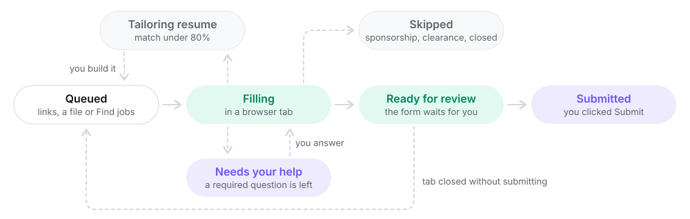

<p align="center">
  <picture>
    <source media="(prefers-color-scheme: dark)" srcset="docs/assets/header-dark.svg">
    
  </picture>
</p>

<h3 align="center">Fills your job applications, then stops before Submit.</h3>

<p align="center">
  You review every form and submit it yourself. Appli keeps track of the rest on a dashboard.
</p>

<p align="center">
  
  
  
  
  
</p>

<p align="center">
  <a href="ONBOARDING.md"><b>Get started</b></a> &nbsp;|&nbsp;
  <a href="#what-it-does">What it does</a> &nbsp;|&nbsp;
  <a href="#how-a-job-moves">How a job moves</a> &nbsp;|&nbsp;
  <a href="#every-day">Every day</a> &nbsp;|&nbsp;
  <a href="#safety">Safety</a>
</p>

<br>

<p align="center">
  <picture>
    <source media="(prefers-color-scheme: dark)" srcset="docs/assets/demo-dark.svg">
    
  </picture>
</p>

## What it does

- **Fills forms in a real browser.** Greenhouse, Lever and Ashby forms are filled in one pass. Workday is filled page by page. Each finished form stays open in its own tab, marked _Ready for review_.
- **Never clicks Submit.** You do. Two guards (network and DOM) cancel any submission while a form is being filled.
- **Sends your best resume.** Every resume is scored against the posting's skills. Under 80%, a tailored version is drafted for you to approve change by change.
- **Answers only from your facts.** Your profile, resume and saved answers are the only sources. Anything else is left blank and flagged, never guessed.
- **Skips postings that rule you out:** no sponsorship, US citizens only, clearance required, or closed.
- **Finds new postings** on public job boards and the SimplifyJobs lists, already scored against your resumes.

## Get started

You need Python 3.11+, Node 18+, your own [OpenRouter](https://openrouter.ai/keys) key, and a login from the project owner.

1. Clone the repo, then double-click **`start.bat`** (Windows) or run **`./start.sh`** (Mac/Linux).
2. The first time, it opens `.env`. Fill in the three lines at the top (Supabase URL, publishable key, OpenRouter key) and start it again.
3. Sign in at http://localhost:8765 and follow the setup screens once: name, resumes, cover letter, profile, jobs.

The full walkthrough is in **[ONBOARDING.md](ONBOARDING.md)**.

Each person's files live in `users/<Full Name>/` (git-ignored), in this layout:

```
users/Rishi Rugweda Dixit/
  appli.json                      what's in the folder (written by the app)
  profile.md                      the profile every model call reads (synced from the Profile tab)
  Rishi Resume SWE/               Rishi Resume SWE.pdf + main.tex (LaTeX = tailoring)
  Rishi Resume AI Eng/ ...
  Cover letter/                   your own letter: the voice for generated ones
  tailored/<job id>/              tailored resumes
```

## How a job moves

<p align="center">
  <picture>
    <source media="(prefers-color-scheme: dark)" srcset="docs/assets/flow-dark.svg">
    
  </picture>
</p>

Green steps are Appli's; violet ones are yours.

## Every day

Double-click **`start.bat`**. It builds the dashboard and opens http://localhost:8765. Sign in and press **Run 20**.

A browser window opens and fills applications one at a time (best-fit tiers first). Each finished form stays open in its own tab, marked _Ready for review_.

- **Submit it yourself.** The runner watches the tabs and marks the job **Submitted** when it sees the confirmation page.
- **Close a tab without submitting** and that job goes back in the queue.
- **Stop** (on the dashboard) ends the run; anything still unsubmitted goes back in the queue.
- Closing the whole browser window also ends the run.
- Only one run can be active at a time.

Command-line equivalent: `.venv\Scripts\python -m runner run --limit 20` (or `--ids 12,40` for specific jobs). Command-line tools act as whoever last signed in on this computer's dashboard. `APPLI_HEADLESS=1` hides the browser (testing only).

## Dashboard

| Tab               | What's on it                                                                                                                                                                                                                             |
| ----------------- | ---------------------------------------------------------------------------------------------------------------------------------------------------------------------------------------------------------------------------------------- |
| **Applications**  | What still needs action: ready for review, queued, needs manual, failed. **+ Add jobs** pastes links or uploads a CSV/Excel file. Submitted and skipped jobs are kept out of "All"; skipped ones have their own chip so you can see why. |
| **Find jobs**     | New postings that fit you, to add with a tick.                                                                                                                                                                                           |
| **Applied**       | Everything you've submitted, newest first, grouped by day.                                                                                                                                                                               |
| **Resume review** | Tailored resume drafts, one tickable change at a time.                                                                                                                                                                                   |
| **Saved answers** | Answers reused on every later form. Rules starting with `~` (e.g. `~how did you hear\|referral`) match any question containing those phrases.                                                                                            |
| **Profile**       | The facts every model call reads.                                                                                                                                                                                                        |
| **My files**      | Resumes, cover letter, Workday login and the system check.                                                                                                                                                                               |

Each job shows its status, what was filled (and by which tier), the cover letter, and questions left for you.

For development: `cd dashboard && npm run dev` (proxies the Run button to the server on port 8765).

## Safety

- The runner never clicks Submit. Two guards (network + DOM) also cancel any submission while it is filling; they lift per page once it is ready for you.
- Postings that say no sponsorship / US citizens only / clearance required / closed are skipped and logged, with the quoted reason.
- Anything not in your profile, resume or saved answers is left blank, never guessed. When a **required** question is left (on any site), the job shows **Needs your help** with the questions listed in its panel: save an answer there and it's typed into the open form within a few seconds (and reused on every matching question later), or fill it in the browser. Once no required question is empty the job moves to **Ready for review**.
- How forms are filled: the resume is attached first (some forms re-read it and reset name / email), every dropdown's options are read before answering, and a final pass re-types any required answer a form cleared. Ashby's "Autofill from resume" box is never used (it re-draws the form and drops typed answers). A job board that's down (502/503) is retried and, failing that, stays queued for the next run.
- Legal and consent questions (family ties, conflicts of interest, criminal history, consent/acknowledgement) are never answered by the model. They stay blank unless you saved an answer. "If yes, provide details" follow-up boxes stay blank too.
- The Run button's server listens on 127.0.0.1 only and rejects requests from other websites.
- On Workday the runner clicks Next / Save and Continue only once nothing required is left on the page. It never clicks Submit or Create Account.
- iCIMS, SmartRecruiters, Oracle, Paylocity and other sites are marked `needs_manual` for now.

## How it works

<details>
<summary><b>Resume matching and tailoring</b></summary>

Each resume lives in its own folder in `users/<Name>/` with its LaTeX source (`Rishi Resume SWE/main.tex` + the PDF). PDF-only resumes get match % but no tailoring.

- **Every job:** the posting's requirements (languages, tools, concepts) are extracted, and every resume is scored on how many it covers (required terms count double). The best one is uploaded, and the scores are shown on the job.
- **Below 80%:** the form is still filled with the best resume, and a tailored version is drafted for **Resume review**. Each change is one tickable item with before/after, the exact words added and removed, and the sentence in your own materials that proves it. Terms you don't have anywhere are listed as **gaps** and never added; rejected edits and the reason are shown under **What went wrong**.
- **Build (= approve):** the job goes back to the front of the queue (even if it was already filled with the base resume, unless you submitted it) and is filled again with the tailored PDF; **Fill it now** starts that right away. The PDF is compiled from your LaTeX with only the ticked changes and saved in `users/<Name>/tailored/<job id>/` (with the `.tex` and a `.changes.md` log). Any later fill of that job uses the tailored PDF.
- **One-time:** run `supabase/migrations/002_resume_tailoring.sql` in the Supabase SQL editor.
- **Commands:** `python -m runner resume-check` (compile your LaTeX resumes), `python -m runner tailor --id 16 [--force] [--build]` (dry run for one job).

</details>

<details>
<summary><b>Jev decisions, match % and the Tailoring pause</b></summary>

**Jev** (`typesafe/jev-1.13` on OpenRouter, same API key) is a decision model: it picks, it doesn't write. Each call takes about half a second and costs fractions of a cent.

- **Known answers:** every question not answered from your profile goes to Jev in one request per form. It picks the form's option, or matches the question to one you've answered before even if it's worded differently, and outputs that saved answer. If it isn't confident (below 60%), the question is left for you. Short free text it can't match goes to DeepSeek; essays and cover letters go to Luna, in parallel.
- **Learning:** answers to factual yes/no and dropdown questions are saved as **Learned** answers for next time. Essays, free text, legal and consent questions, and anything about one company or office are never learned. Edit a learned answer on Saved answers and it becomes yours. `python -m runner learn` seeds this from forms already filled.
- **Resume choice:** every resume is scored on the posting's skills (required count double). Jev picks the resume from those numbers, but never one more than 10 points below the best.
- **Screening:** Jev also reads each posting for "no sponsorship", "US citizens only" and clearance requirements, on top of the text patterns.
- **Tailoring pause:** if the chosen resume matches under 80% and your materials support some missing skills, the job isn't filled. It goes to **Tailoring resume**, a draft appears in Resume review, and no daily slot is used. **Build** puts it at the front of the queue to be filled with the tailored PDF; **Use base resume instead** fills it with the best base resume.
- **Match %** shows on every job (green at 80%+, amber 60–79%, red below), with a filter, a sort, today's average, and live on the run card.
- **One-time:** run `supabase/migrations/002_resume_tailoring.sql` then `003_jev_tailoring_state.sql`. Until then the runner fills as before and `python -m runner ping` reports them as not applied.
- Each job logs a timing line (chat models vs Jev vs browser). Screenshots are no longer taken.

</details>

<details>
<summary><b>ATS criteria: how match % is scored and how tailoring edits</b></summary>

Implemented in `runner/resume/match.py` (scoring) and `runner/resume/tailor.py` (edits):

- **Exact vs. semantic matching.** Legacy ATSs (e.g. Taleo) match exact strings; modern ones (Greenhouse, Lever) use NLP and understand synonyms. Exact phrasing is safest everywhere, so an exact match earns full credit. A skill your resume shows under another name ("Git/GitHub Flow" for "version control") earns half credit; Jev judges these at 80%+ confidence. The dashboard shows both numbers: **exact wording** (what older ATSs see) and **counting equivalents** (newer ATSs). Tailoring turns equivalents into the posting's exact wording.
- **Categorical weighting.** Hard skills, specific tools, platforms, databases, certifications and the official job title count fully; broad concepts count 0.6. Soft skills aren't extracted. Required terms count double.
- **Frequency and density.** The goal is 1–3 natural mentions per term. More than 3 is flagged as keyword stuffing, and tailoring may never push a term past 3.
- **Where keywords live.** The Skills section holds direct hard skills; Work Experience bullets are the contextual proof, tied to action verbs and results. Hard skills listed only in Skills, never in a bullet, are flagged. Tailoring puts tools in the Skills line and concepts in bullets.
- **Mirror the posting's terminology.** Requirements are extracted in the posting's exact words, and tailoring uses those words ("project management", not "managing projects").
- **Layout.** Your resumes are already ATS-friendly: single column, standard headings (Education, Work Experience, Projects, Technical Skills), no text boxes or graphics. Tailoring never changes the layout. There's no Professional Summary section; tailoring doesn't add one because it only edits existing lines.
- `python -m runner rescore [--dry-run]` recomputes match % for queued, tailoring and ready-for-review jobs without filling anything.

</details>

<details>
<summary><b>Find jobs</b></summary>

The **Find jobs** tab searches for postings that fit you; you pick which to add.

- **Sources:** the public job boards (Greenhouse, Lever, Ashby, Workday) of every company already in your jobs plus any careers links you add, and SimplifyJobs' new-grad / internship lists on GitHub. No scraping, no accounts.
- **Preferences** (saved in `users/<Name>/search.json`): job titles (suggested from your profile), level (internships / new grad / entry), locations (empty = anywhere in your country; "Remote"), posted within N days, words to skip (senior, staff...).
- **Pipeline:** anything already in your jobs is dropped; the best candidates (sites Appli fills, newest, early-career titles) are read, screened for sponsorship / citizenship / clearance exactly like a run (patterns + Jev), and scored against your resumes. Tick results and **Add to my jobs**: they join the queue with their match % (better matches get a better tier).
- Command line: `python -m runner find` (results appear on the tab).

</details>

<details>
<summary><b>Workday, page by page</b></summary>

Workday needs an account on each company's site and its forms are several pages long.

- **Once:** on **My files → Workday login**, save the one email + password you use for Workday everywhere (stored only in your folder).
- **Screening first.** Every Workday posting is screened (sponsorship / US citizens only / clearance / closed, by pattern and Jev) before Apply is clicked, so no account is made for jobs you'd be skipped for. **Pre-screen Workday jobs** on Applications does the whole queue up front without opening any form (`python -m runner screen --ats workday`).
- **The flow:** Apply → **Apply Manually** (Workday's resume parsing garbles entries, so Appli fills them from your profile instead) → sign in / create account (email + password typed in; you do the CAPTCHA, terms box or email check and click the button) → each page is filled and, when nothing required is left, **Appli clicks Next / Save and Continue itself** → on **Review** the job is _Ready for review_ and **you Submit**. Appli never clicks Submit or Create Account.
- **Needs your help:** when a page has required questions Appli can't answer (or Workday reports an error), the job shows **Needs your help** and lists them in its panel. Save an answer there: it's typed into the open page within a few seconds, the page continues, and the answer is reused on every matching question later. Or just fill it in the browser: the page is re-checked every few seconds and, once no required field is empty, Appli clicks Save and Continue itself. It only ever stops on a page it can't finish; the log and the dashboard name the exact fields. Where you already have an account on that company's Workday (and there's no CAPTCHA), it also clicks Sign In with your saved login.
- **My Experience** is filled from your profile: one Work Experience block per role (title, company, dates, "I currently work here", your bullets as the description), one Education block per degree (school matched strictly, else "Other"; degree, field of study, GPA, dates), your skills where Workday's list has the same name, your GitHub / website, and your chosen resume uploaded. Anything it can't fill shows under Needs your help.
- **Company questions** ("Application Questions" pages) are answered only from your saved answers and profile, never by a model.
- Several Workday applications can be open at once; the runner keeps filling other jobs while one waits for you. Closing a Workday tab puts the job back in the queue.
- **One-time:** run `supabase/migrations/005_workday_steps.sql` and `006_needs_help.sql` (the Submission required and Needs your help statuses). Workday jobs parked as "not automated yet" go back to the queue on the next run.

</details>

<details>
<summary><b>Education</b></summary>

Every education entry in your profile is filled (a second block is opened with "Add another"). School names come from your resume. If a school isn't in a site's list it picks **Other**, never a look-alike.

</details>

## Project owner (admin)

The Supabase project is shared. Each person signs in with their own account and only sees their own rows.

- **First time:** run in the Supabase SQL editor, in order: `supabase/schema.sql`, then `migrations/002` through `006_needs_help.sql`. 004 gives every row an owner; existing rows go to the email at its top. In Authentication → Providers → Email, turn off "Allow new users to sign up".
- **Add a friend:** Authentication → Users → **Add user** (their email + a password, auto-confirm). Send them the project URL, the **publishable** key and their login. Never share the service-role key: nobody needs it.
- **Your own files:** on your first sign-in, the setup screen offers **Use my existing files**. It copies `jobright_profile.md`, the three resume folders, `Cover letter/`, `resumes/tailored/` and the browser profile into `users/<your full name>/` and saves your profile to the database. The originals are left in place; delete them once you're happy.
- You can see all data in the Supabase console; tell friends that.
- **How the runner signs in:** at sign-in the dashboard also opens a second, separate session for the runner and hands it to the local server (`out/sessions/`, git-ignored). The runner refreshes it itself, so no password is stored in `.env` and the dashboard and runner never log each other out.

---

<p align="center">
  <br>
</p>
